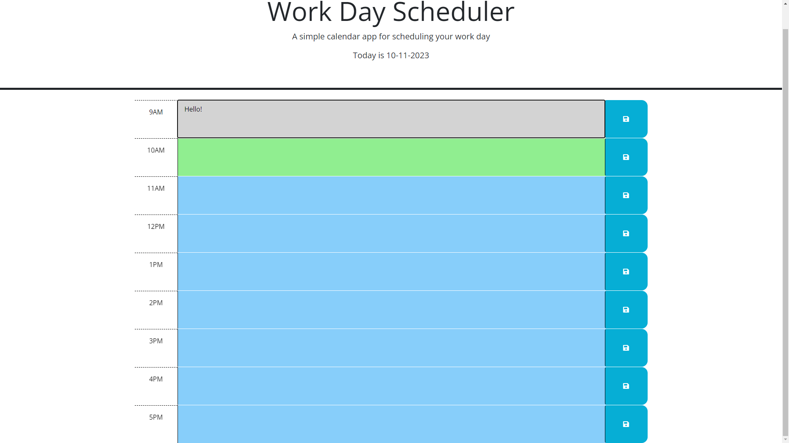

# work-scheduler

## Description

Provide a short description explaining the what, why, and how of your project. Use the following questions as a guide:

- What was your motivation?
To create a day planner to keep track of events during the day.
- Why did you build this project? (Note: the answer is not "Because it was a homework assignment.")
To keep daily evvents organized by hour each day and to save new events for future times.
- What problem does it solve?
Keeping track of daily to do items by the hour.
- What did you learn?
jQuery and using dayjs to keep current date and times to match the users local time.

## Table of Contents (Optional)

If your README is long, add a table of contents to make it easy for users to find what they need.

- [Installation](#installation)
- [Usage](#usage)
- [Credits](#credits)
- [License](#license)

## Installation

What are the steps required to install your project? Provide a step-by-step description of how to get the development environment running.
Download and clone the repository from GitHub, set up directory you would like to use for the repository. Open index.html in live browser to see the deployed page.

## Usage

Provide instructions and examples for use. Include screenshots as needed.
When opening the page the current date should display in the header, the user can then add events in the different time slots, and click the save button to save the event, so when the page is closed or refreshed it will keep the data saved to look back to in the future or to see past events.

To add a screenshot, create an `assets/images` folder in your repository and upload your screenshot to it. Then, using the relative filepath, add it to your README using the following syntax:


    ```md
    
    ```

## Credits

List your collaborators, if any, with links to their GitHub profiles.
N/A

If you used any third-party assets that require attribution, list the creators with links to their primary web presence in this section.
N/A

If you followed tutorials, include links to those here as well.
N/A

## License

The last section of a high-quality README file is the license. This lets other developers know what they can and cannot do with your project. If you need help choosing a license, refer to [https://choosealicense.com/](https://choosealicense.com/).

---

🏆 The previous sections are the bare minimum, and your project will ultimately determine the content of this document. You might also want to consider adding the following sections.

## Badges


Badges aren't necessary, per se, but they demonstrate street cred. Badges let other developers know that you know what you're doing. Check out the badges hosted by [shields.io](https://shields.io/). You may not understand what they all represent now, but you will in time.

## Features

If your project has a lot of features, list them here.

## How to Contribute

If you created an application or package and would like other developers to contribute it, you can include guidelines for how to do so. The [Contributor Covenant](https://www.contributor-covenant.org/) is an industry standard, but you can always write your own if you'd prefer.

## Tests

Go the extra mile and write tests for your application. Then provide examples on how to run them here.
